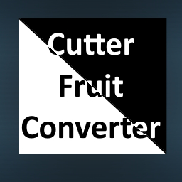

 

<h3 align="center"><u>FS22_CutterConverter</u></h3>

    The CutterConverter overwrites the `processCutterArea` method for a cutter and converts one fruit into another 1:1. It's good for WinterWheat -> Wheat conversion.

## Credits
* Sqeep

# Copyright
Copyright (c) 2023 [Dennis Schmitt](https://github.com/peppie23).
All rights reserved.

(<a href="#readme-top">back to top</a>)
